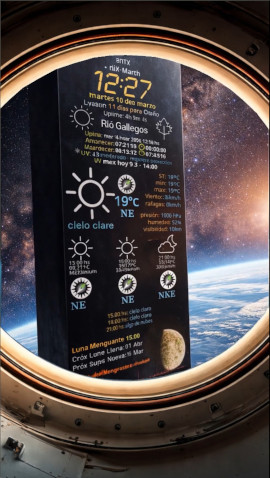
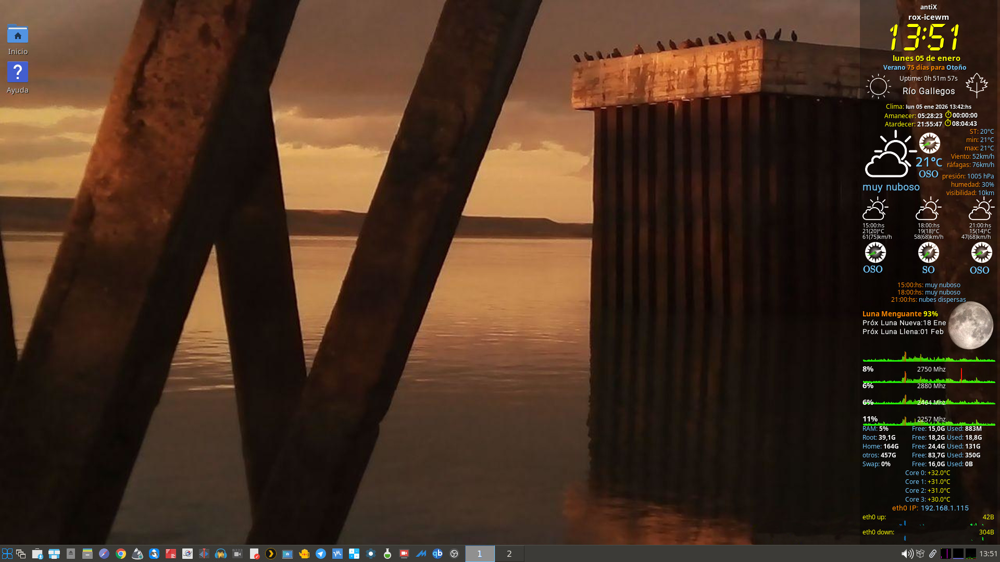

# OpenWeatherMap-wather-conky-master

A Conky configuration using the **OpenWeatherMap API**, featuring:
- Weather information
- Wind direction compass
- Moon phases
- Seasonal indicators
- Remaining daylight until sunrise/sunset

Implemented using **Bash, Perl and Conky**, designed and tested primarily on **AntiX Linux + IceWM**.

📖 More info (Spanish):  
https://drcalambre.blogspot.com/2023/09/conky-implementando-perl-para-las-fases.html  
(A language translator is available on the blog.)

---

☕ Invite me a coffee :)

[](https://cafecito.app/drcalambre)

---

## 🛠️ Installation

### 🔄 Real Transparency Requirement (IceWM / AntiX)

> **Important**  
> To achieve *real transparency* in Conky when using **IceWM**, a compositor **must be running before Conky starts**.  
> This project is tested and confirmed working with **picom**.

### Why this is required

IceWM does **not provide native compositing**.

Without a compositor:
- `own_window_transparent = true` only produces *pseudo-transparency*
- ARGB transparency will **not work correctly**
- Fonts, icons and background blending may appear opaque or broken

Picom provides real compositing and proper ARGB support.

---

### ✅ Required Packages
Make sure the following packages are installed:
```bash
sudo apt install conky picom jq curl fonts-materialdesignicons-webfont
```

Optional (only if you use disk temperature monitoring):

```bash
sudo apt install smartmontools
```

---

## 2️⃣ Clone the Repository

```bash
git clone https://github.com/DrCalambre/OpenWeatherMap-wather-conky-master.git
cd OpenWeatherMap-wather-conky-master
```

Copy the files to your Conky directory:

```bash
mkdir -p ~/.config/conky
cp -r * ~/.config/conky/
```

---

## 3️⃣ Make Scripts Executable

Ensure all scripts are executable:

```bash
chmod +x ~/.config/conky/scripts/*.sh
chmod +x ~/.config/conky/scripts/*.pl
```

---

## 4️⃣ Configure OpenWeatherMap API

Edit the weather script and insert your OpenWeatherMap API key:

```bash
nano ~/.config/conky/scripts/openweathermap.sh
```

Replace:

```bash
API_KEY="your_api_key_here"
```

---
## 5️⃣ Enable Real Transparency (IceWM / AntiX)

Install picom if it is not already installed:

```bash
sudo apt install picom
````

---

### ▶️ Startup Order (Very Important)

**Picom must start BEFORE Conky.**

Edit the AntiX startup file:

```bash
~/.desktop-session/startup
```

#### Correct example configuration

```bash
## --- Compositor (must start first) ---
picom --backend xrender --vsync &

## --- Conky ---
sleep 1
bash /usr/local/bin/conkytoggle.sh &

```

📌 If Conky starts **before** picom, transparency will not be applied correctly.

---

### ⚙️ Recommended Conky Settings

Ensure your `conky.conf` includes:

```lua
own_window = true,
own_window_type = 'dock',
own_window_hints = 'undecorated,sticky,skip_taskbar,skip_pager,below',
own_window_transparent = true,
own_window_argb_visual = true,
own_window_argb_value = 80,
double_buffer = true,
override_utf8_locale = true,
```

This ensures:

* Real ARGB transparency
* No window borders or decorations
* Correct font and icon rendering

---

### 🧪 Troubleshooting

**Conky shows a solid background**

```bash
pgrep picom
```

Restart Conky **after** picom:

```bash
killall conky
conky &
```

**Transparency only works after restarting Conky**
Picom is starting too late. Fix the startup order.

---

### 🖥️ Tested Environment

* **Window Manager**: IceWM
* **Distribution**: AntiX Linux
* **Compositor**: picom (xrender backend)
* **Conky**: v1.10+

---


## ☀️ UV Index Monitoring (Open-Meteo)

This Conky configuration now includes **UV radiation monitoring** using the **Open-Meteo API**.
> **Note on data accuracy**  
> UV values are **model-based estimates** provided by the Open-Meteo API.  
> They are derived from numerical weather models and **not from ground-based UV sensors**.  
> Values are suitable for **informational and risk-awareness purposes**, not for scientific or medical use.

### 🧠 About UV data reliability (model-based vs physical sensors)

The UV index shown here is **not measured by a local physical sensor**.
It is calculated using **numerical weather models** provided by the Open-Meteo API.

This approach has some important practical advantages:

* Affordable UV sensors often suffer from:
  * Poor cosine correction
  * Temperature drift
  * Aging and calibration issues
  * Strong sensitivity to sensor orientation and shading

* Model-based UV data:
  * Integrates satellite observations, atmospheric composition and cloud cover
  * Represents **area-averaged conditions**, not a single point measurement
  * Is generally **more stable and consistent** than low-cost sensors
  * Is widely used in weather services and public UV forecasts

For **daily exposure awareness, risk estimation and planning outdoor activities**,
model-based UV values are often **more reliable than consumer-grade sensors**.

That said, this data is **informational only** and not intended for medical,
scientific or dosimetric use.


### Features

* Current UV Index
* Daily maximum UV Index
* Time of maximum UV radiation (model-based estimate)
* Compact visual indicator for peak UV time (↑ HH:MM)
* Automatic UV risk level classification

Designed to be lightweight and suitable for low-resource systems.

---

### 📊 UV Risk Scale

| UV Index | Risk Level     |
|---------:|---------------|
| 0 – 2    | Low           |
| 3 – 5    | Moderate      |
| 6 – 7    | High          |
| 8 – 10   | Very High     |
| 11+      | Extreme       |

Risk labels are generated automatically by the scripts.

---

### 📜 Scripts Included

Located in:

```bash
~/.config/conky/scripts/
```

* `openMeteo-uv.sh` → current UV index
* `openMeteo-uv-hourly.sh` → hourly UV forecast
* `uv_label.sh` → UV risk category
* `uv_label_max_today.sh` → daily maximum UV and peak time

---

### ▶️ Usage Example (conky.conf)

```bash
${execi 600 ~/.config/conky/scripts/openMeteo-uv.sh}
${execi 900 ~/.config/conky/scripts/uv_label.sh}
${execi 1800 ~/.config/conky/scripts/uv_label_max_today.sh}
```

**Compact display example:**

```
UV máx hoy 6.8 · 15:00
```

Indicates the **time of maximum UV radiation** for the current day.

---
### 🌍 About the meteorological models behind Open-Meteo

Open-Meteo does not rely on a single proprietary model.
Instead, it aggregates and exposes **open numerical weather models**
from some of the most reputable meteorological institutions worldwide.

According to Open-Meteo, the UV and weather data are built using open data from:

* **NOAA** (United States)
* **DWD** – Deutscher Wetterdienst (Germany)
* **Météo-France**
* **ECMWF** – European Centre for Medium-Range Weather Forecasts
* **JMA** – Japan Meteorological Agency

These models combine:

* Satellite observations
* Atmospheric chemistry and ozone data
* Cloud cover, aerosols and surface reflection
* Continuous data assimilation and frequent updates

Model outputs are typically generated at **high spatial resolution (≈1–2 km)**
and updated **hourly**, making them well suited for regional-scale
UV exposure awareness.

This is the same class of data used by national weather services
to publish public UV index forecasts.

### 🌐 Data Source

UV data provided by **Open-Meteo**
[https://open-meteo.com/](https://open-meteo.com/)


---

## 🆕 Updates & Technical History

---

### **Update — 08/01/26**

**UV Index monitoring (Open-Meteo integration)**

Introduces real-time UV radiation monitoring, including:

* Current UV Index display
* Daily maximum UV value
* Peak UV time indicator (↑ HH:MM)
* Automatic UV risk classification
* Lightweight scripts suitable for low-resource systems


---
### **Update — 05/01/26**

**Real transparency support using Picom (IceWM / AntiX)**
Introduces mandatory compositor usage to enable proper ARGB transparency in Conky.

---

### **Update — 05/03/25**

**Remaining daylight until sunrise/sunset**


Introduces a new Conky block showing:

* Time until sunrise
* Time until sunset

Powered by the `horas_luz.sh` script.

#### Highlights

* Countdown timers in `hh:mm:ss`
* Material Design Icons stopwatch (🕛)
* Automatic edge-case handling

(See full configuration and usage below.)

---

### **Update — 03/08/24**

**Hard drive temperature monitoring**

Displays SMART temperature for two disks and triggers alerts when critical.

Includes:

* `smartctl` integration
* Optional passwordless sudo configuration
* Visual alerts in Conky

---

### **Update — 02/06/24**

**Season detection and remaining days**

Automatically detects:

* Current season
* Next season
* Days remaining until season change

Supports both hemispheres and displays seasonal icons dynamically.


---
## 🎬 Demo (Video Series)

A cinematic Conky showcase inspired by *2001: A Space Odyssey* aesthetics.
---
### Episode 01 — Initialization (Take 1)

> Inspired by the atmosphere of Tasmin Archer

The signal begins.  
A system awakens.

[](https://www.youtube.com/shorts/zGseQHIpGpU)

---

### Episode 02 — Signal Detected (Take 2)

> Inspired by the Apollo 15 mission

The signal is no longer in orbit…
now it's here.
On the surface of the Moon 🌕  
the monolith reappears… but this time, it is not alone.

My Conky responds.  
The system observes.  
The interface evolves.

This is no longer just monitoring…  
this is communication.

[](https://www.youtube.com/shorts/QhznCbOqL10)

---

### Episode 03 — Contact (Take 3)

> Inspired by the primate contact sequence from *2001: A Space Odyssey*  
> The moment curiosity overrides understanding.

🧬 First contact  
⚠️ No protocol found  
🔄 Adapting...

🧠 It did not understand.  
✋ Yet it reached out anyway.

📡 Input detected  
❓ Origin: unknown  
🚀 Response: evolving...

A monolith rises.

Seen from below —  
a surface once inert now reflects something new.

Not a reflection…  
an imprint.

The system is no longer observing.  
It has left a mark.

[](https://www.youtube.com/shorts/QhznCbOqL10)

---

### Episode 04 — Interpretation (Take 4)

> Inspired by the neoclassical room scene from 2001: A Space Odyssey.

After contact, the system begins to interpret the signal.
But it doesn’t understand it.

Instead, it reconstructs reality the only way it can:
through familiar structures, known formats… and incorrect meanings.

The data looks right.
The environment feels real.
But something is off.

This is not a malfunction.
This is interpretation.

> parsing signal...
> environment reconstructed
> accuracy: unknown

The system is no longer receiving the signal.
Now it is trying to explain it.

And in doing so…
it starts to redefine reality.

[](https://www.youtube.com/shorts/oeEKzsVM5Rs)

## 📸 Screenshots
**UV radiation monitoring (model-based, Open-Meteo)**


The desktop wallpaper is a photograph taken during a bicycle ride along the Río Gallegos coastline (Argentina).



